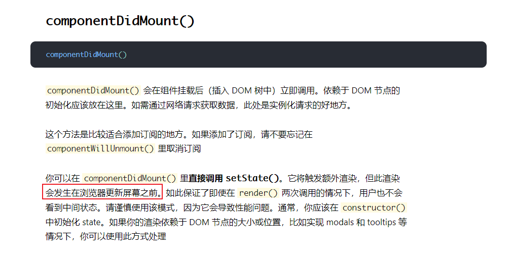

1. 栈： ui栈 数据栈
2. 给你一个项目，如何拆分？
   1. 找角色
   2. 封装：先找使用场景
      实例 与 类
      封装需要先找具体的实例，从实例中寻找共同点。实例是场景，类是解决方案。先想清楚实例都干了什么事，再从实例中抽象出类。不要上来就思考类，思维跨度太大。对于页面的场景，它不是最小单位，可以继续划分成组件。每个组件有它的功能。如果页面是最小单位的话，不论页面多复杂都把代码写到一起，不现实。
      子类 与 父类
      寻找子类的共同点，抽象到父类中。
      对于页面、组件来说，从功能上考虑，每个组件都会有不同的功能，在抽象程度高的层面上，很难从功能上提取共同点。从组件的创建到销毁的整个生命周期去考虑。每个组件都会在不同的时间节点完成一些功能，所以组件提取的共同点是生命周期。初始化，组件渲染完成，更新，销毁前。
   3. 行为归属于谁哪个角色
      准确划分行为归属于哪个角色，即行为的发出者是谁，能够减少思维负担，减少代码量。
      点击事件归属于每个页面。
      动画由页面栈管理。
   4. 角色之间的交互
      页面操纵来实现入栈出栈
   5. 数据的栈管理。当前  

思考方向：场景（角色、实例） 封装 解耦  

细节理解：

1. 使用appendChild removeChild 其他元素不会重新渲染，绑定的事件依然存在。用 innerHTML 因为wrap中所有的页面重新渲染，则需要重新绑定事件。

2.  querySelector 的上下文 可以是 document 也可以是 element (某个元素)

3.  DOMString to Dom  

   1. 使用DOMParser， 注意 parseFromString()  返回的是完整的HTML 文档，所以需要从body中取出dom元素。
   2. 使用 `<templete>`  模板

   ```js
   function stringToDom(domString) {
       const domParser = new DOMParser()
       return domParser.parseFromString(domString, 'text/html').body.firstElementChild
   }
   
   function stringToDom(domString) {
       var template = document.createElement('template');
       html = domString.trim(); // Never return a text node of whitespace as the result
       template.innerHTML = html;
       return template.firstElementChild;
   }
   ```

4. js 如何给 元素 添加动画

   1. 给目标元素添加 class

      ```js
      element.classList.add('anim')
      element.classList.remove('anim')
      ```

   2.  element.style.animation 

      ```js
      document.getElementByID('yourElement').style.animation="spin2 4s linear infinite";
      ```

   以上方法都是使用 css 定义的动画。 `animationstart/end` 事件只能由 css 定义的 animation 或 transition 触发。The animationstart/end (or transitionstart/end) Events are only fired, if an CSS-defined-animation or -transition is used. 

   3. element.animate(keyframe, options)

      ```js
      element.animate([
          {
              left: '100%'
          },
          {
              left: 0
          }
      	], {
              duration: 200,
              fill: "forwards"
      })
      ```

      注意此方法不会触发 animation 相关事件，因为动画不是 css 定义的。可以使用 `Animation.onfinish` 达到同样的效果。

      ```js
      const animation = element.animate(...)
      animation.onfinish = function()
      ```

      

问题：

1. 页面加载到wrap中这个行为，由谁来实现？

2. 当前页面点击进入的下一个页面在哪里绑定？

3. 页面由谁开启 position-absolute？

4. https://zh-hans.reactjs.org/docs/react-component.html#constructor

   

   